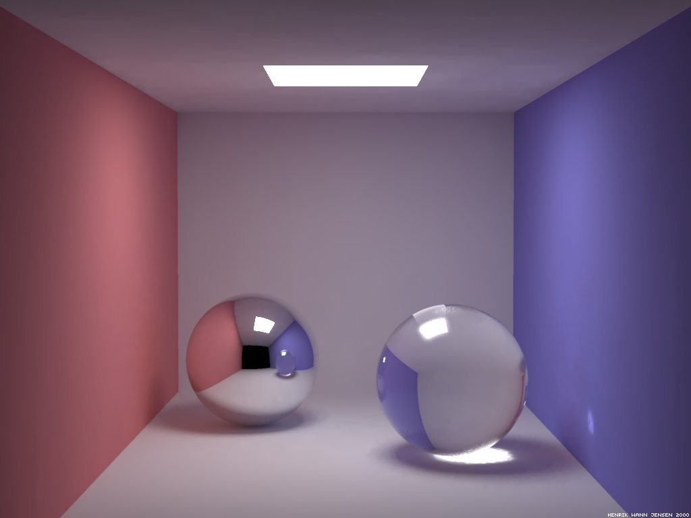
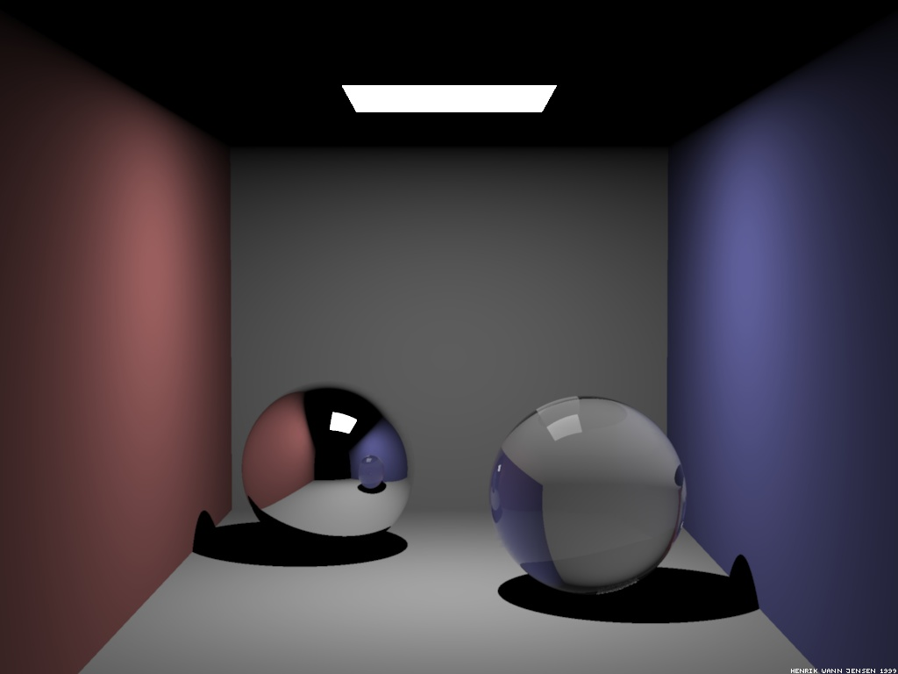
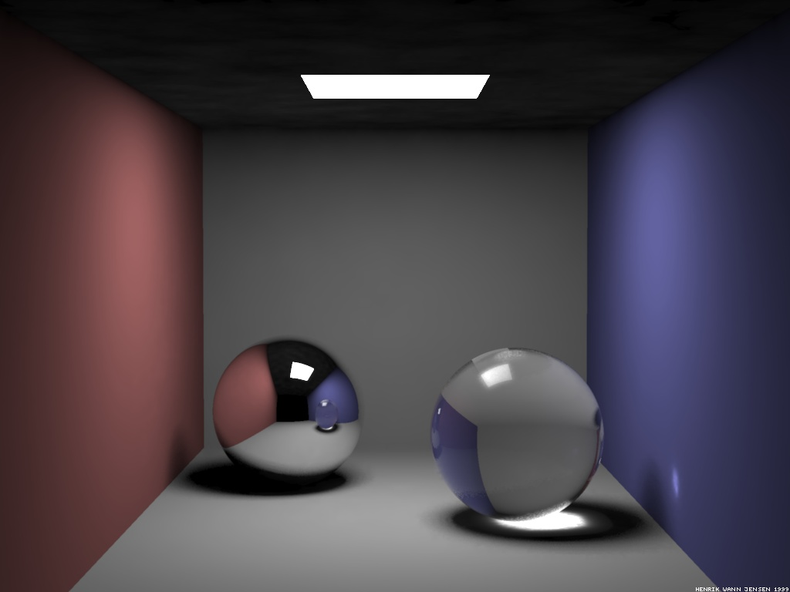

{width="300px"}
{width="300px"}
{width="300px"}
{width="300px"}

# Summary

The purpose of this project is to improve the ray tracer done during assignments to add support for indirect lightning, soft shadows, caustics, fluorescense and volumetric lightning/light shafts.

# Goals and Deliverables
## Minimum Implementation

- The minimal implementation consists of ray tracer that implements global lightning, soft shadows and caustics. [Fig. 1]
- It will be implemented in C++.

## Optional Extensions
- Fluorescent objects
- Volumetric lightning/light shafts

# Schedule
## Week 1
- Global lightning implementation.

## Week 2
- Soft shadows. [Fig. 4]

## Week 3
- Caustics implementation (by implementing transparent objects and light refraction). [Fig. 3]

## Week 4
- Bugs correction.
- Optional features implementation.

## Week 5
- Correct last minute problems.
- Render scene for submission.

# Workload
Dynamic and fair workload distribution

# Resources
## Soft Shadows
- https://www.imgtec.com/blog/ray-traced-soft-shadows-in-real-time-spellwrath/
- Soft Shadows For Ray Tracing (ETH-CGL)
