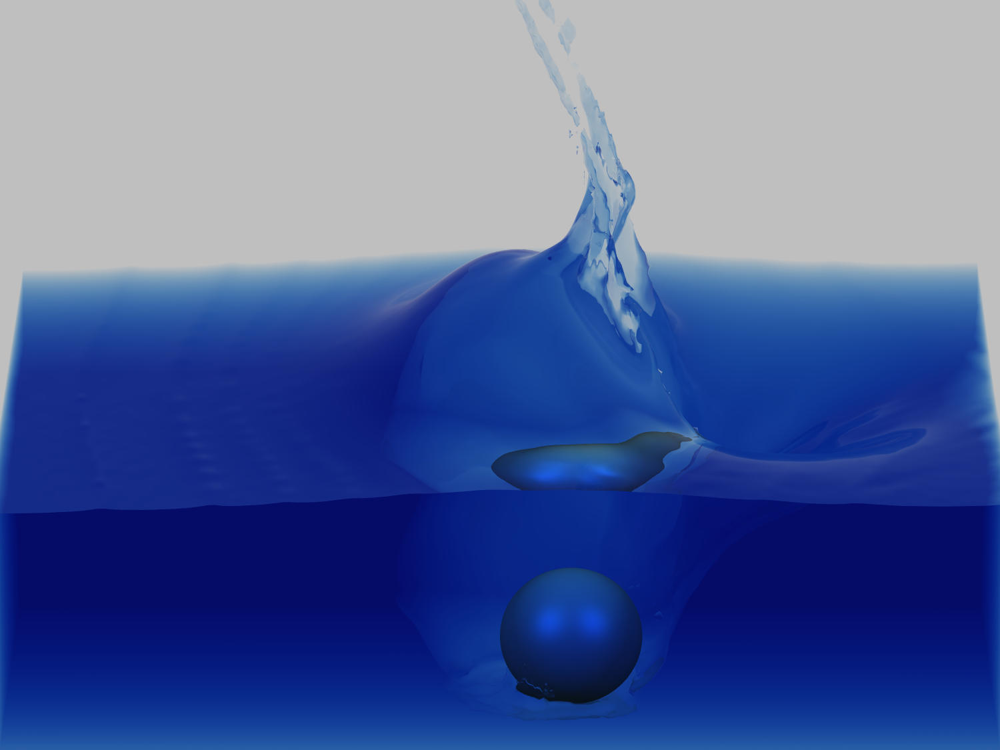
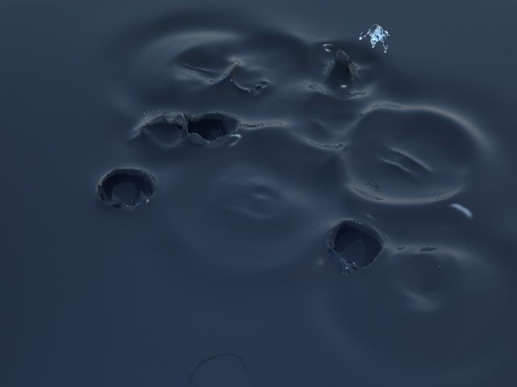
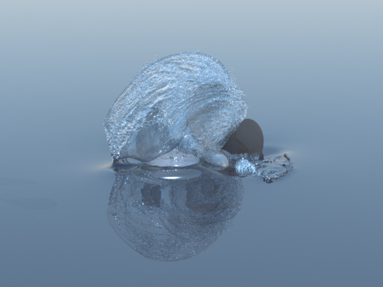

{width="300px"}
{width="300px"}
{width="300px"}

# Title and Summary

Interactive ball thrower into water. The purpose of this project is to render fluids effects when solid objects controlled by the user are thrown into water.

# Goals and Deliverables
## Minimum Implementation

- The minimal implementation consists of a volume of water modelisation that reacts to dropped objects into it. The water volume will be connex. [Fig. 1]
- It will be implemented in C++ and OpenGL.

## Optional Extensions
- Interactivity : the user can select one object among multiple shapes and move them into and out the water to perturb it.
- Water particules ejections. [Fig. 2]
- Moving parts in the water moving the water. [Fig. 3]

# Schedule
## Week 1
- Model a static volume of transparent water
- Model a simple sphere that falls under gravity

## Week 2
- Implement basic water effects

## Week 3
- Model more complex objects
- Make it interactive : choose objects and move them

## Week 4
- Debug, fix problems, implement more complex water effects like droplets.

## Week 5
- Add cherry on the cake, prepare report and video

# Resources
- Animation and Rendering of Complex Water Surfaces. Douglas Enright. Stanford University. Industrial Light & Magic enright@stanford.edu. Stephen Marschner.
- Chimera Grids for Water Simulation. R. Elliot English Stanford University, Linhai Qiu Stanford University, Yue Yu Stanford University, Ronald Fedkiw Stanford University - Industrial Light + Magic
- Fast Water Simulation Methods for Games. TIMO KELLOMÄKI , Colossal Order Ltd (formerly Tampere University of Technology)
