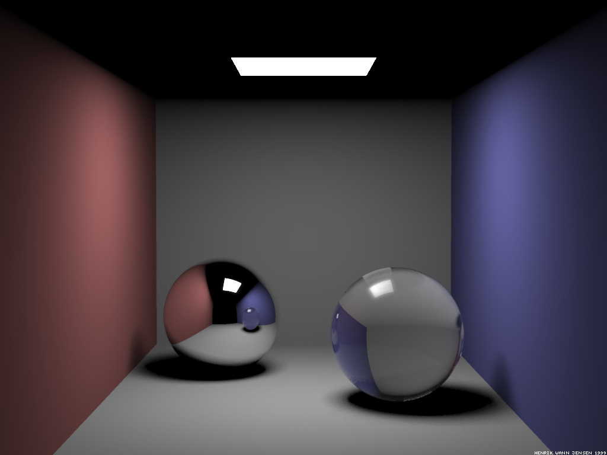

{width="300px"}
{width="300px"}
{width="300px"}

# Summary
The purpose of this project is to improve the ray tracer developped during the semester with path tracing so that it can generate more realistic effects like global illuminations and soft shadows.

# Goals and Deliverables
## Minimum Implementation
- Diffuse objects
- Soft shadows
- Global illuminations
- It will be implemented in C++.

## Optional Extensions Ideas
- Specular objects
- Transparent objects
- Caustics
- Glossy reflections
- Motion blur
- Depth of field

# Schedule
## Week 10 : Initial Scene Composition
- Implement a rectangular source light
- Implement walls
- Implement boxes
- Compose a Cornell Box

## Week 11 : Path Tracing I
Start path tracing implementation

## Week 12 : Path Tracing II
Continue and finish path tracing implementation

## Week 13 : Extensions Implementation
Choose extensions from enumerated ideas

## Week 14 : Final Work
- Debugging
- Report Redaction
- Final scenes rendering

# Workload
Dynamic and fair workload distribution

# References
- ../res/references/Monte-Carlo-Ray-Tracing-Cornell-Lecture.pdf
- ../res/references/Global-Illumination-Path-Tracing-Taku-Komura-Lecture.pdf
- ../res/references/Path-Tracing-Matthias-Teschner-Lecture.pdf
- en.wikipedia.org/wiki/Path_tracing
- scratchapixel.com/lessons/3d-basic-rendering/global-illumination-path-tracing
